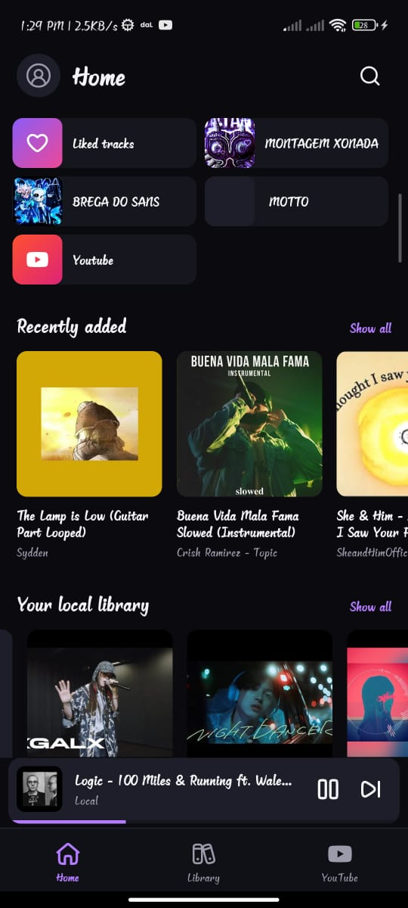
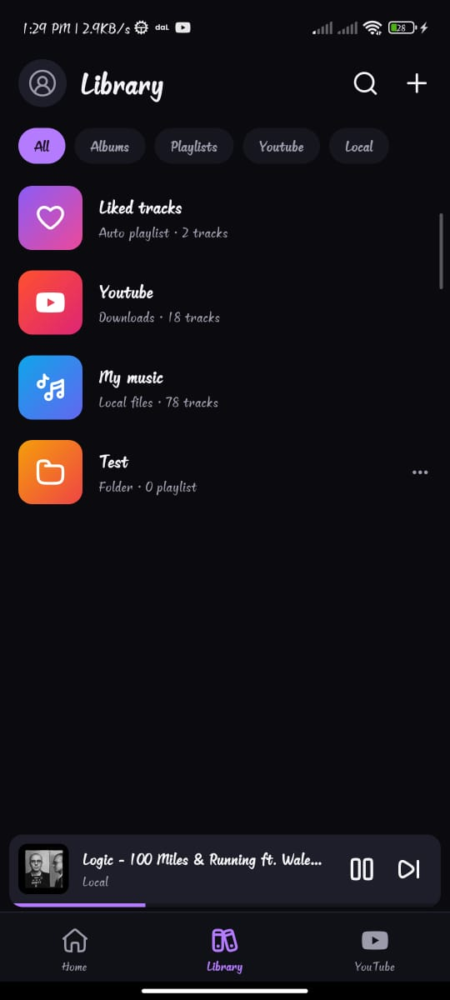
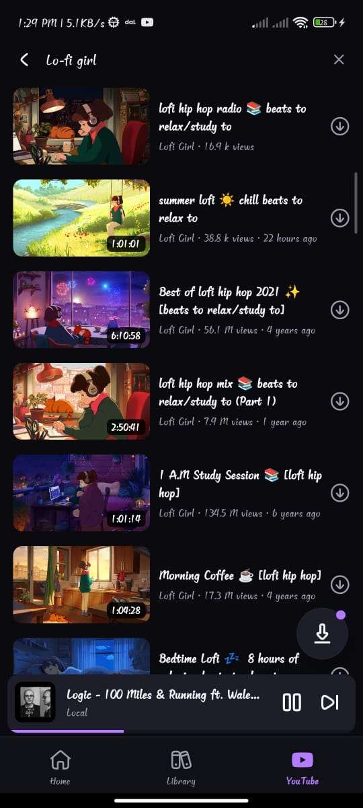
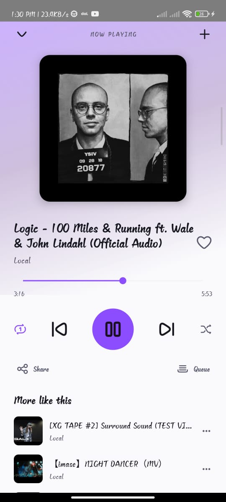
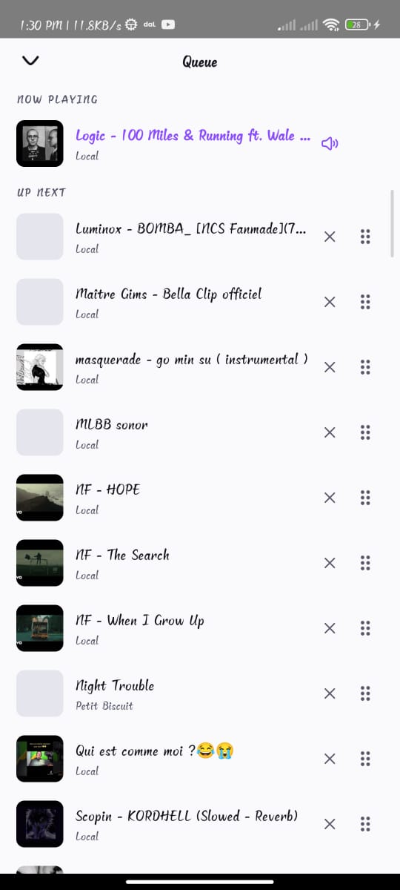
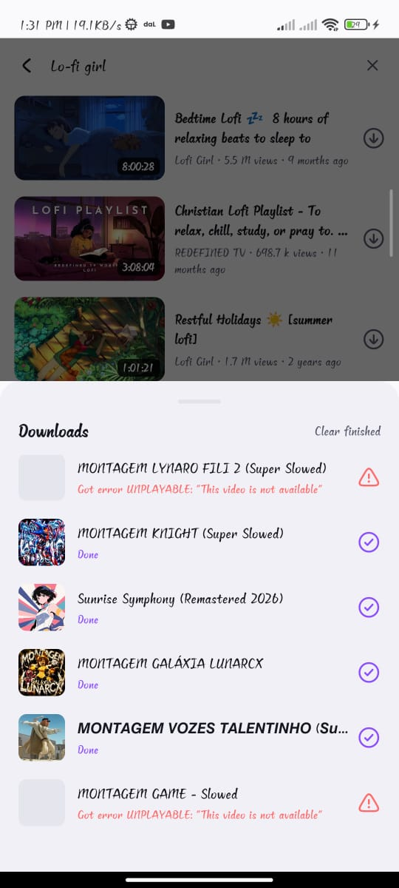

<div align="center">

# MusicApp

[](https://www.typescriptlang.org/)
[](https://reactnative.dev/)
[](https://www.android.com/)

[](https://www.npmjs.com/package/react-native-track-player)
[](https://github.com/TeamNewPipe/NewPipeExtractor)
[](https://github.com/NanoHttpd/nanohttpd)

[](https://github.com/goddivor/mymusic.io/stargazers)
[](https://github.com/goddivor/mymusic.io/network/members)
[](https://github.com/goddivor/mymusic.io/watchers)
[](https://github.com/goddivor/mymusic.io/graphs/contributors)
[](https://github.com/goddivor/mymusic.io/issues)

Your music, yours. A fully offline-first Android music player — local library,
native YouTube browsing with instant audio streaming and downloads, and a
built-in Wi-Fi web player. No account, no ads, no server.

</div>

## Screenshots

<p align="center">
  
  
  
</p>

<p align="center">
  
  
  
</p>

## Features

- **Local library** — every audio file on the device via Android MediaStore,
  with full metadata: title, artist, album, cover art, duration. Albums,
  playlists and playlist folders, likes, play counts and recents.
- **Native YouTube tab** — trending feed, search with live suggestions, native
  video pages (views, likes, related videos, comments). No WebView, no ads.
- **Instant audio streaming** — play any YouTube video as audio in one tap,
  in the background, screen off.
- **Audio downloads** — download videos, whole playlists or YouTube Music
  albums as audio for offline listening; playlists are recreated locally.
- **Background playback** — notification and lock-screen controls, queue
  management with drag-to-reorder, shuffle and repeat.
- **Web access** — one switch starts an embedded LAN server: open the address
  on any computer on the same Wi-Fi, pair with a PIN and stream your whole
  library from the browser.
- **Live theme & language** — dark / light / system theme and English / French
  interface, both switchable instantly.

## Requirements

- Node.js ≥ 20 and npm
- JDK 21 (`JAVA_HOME` must point to it)
- Android SDK (API 36) with an Android device or emulator
- Linux/macOS/Windows — Android builds only

## Installation

```bash
# 1. Clone and install dependencies
git clone https://github.com/goddivor/mymusic.io.git
cd mymusic.io
npm install

# 2. Build the embedded web player (served by the in-app LAN server)
npm run webapp:build

# 3. Start Metro
npm start

# 4. In another terminal, build and install on a connected device
export JAVA_HOME=/usr/lib/jvm/java-21-openjdk-amd64
npm run android
```

To build a standalone debug APK:

```bash
cd android && ./gradlew :app:assembleDebug
# APK -> android/app/build/outputs/apk/debug/app-debug.apk
```

---

<div align="center">
For personal use only — please respect YouTube's Terms of Service.
</div>
